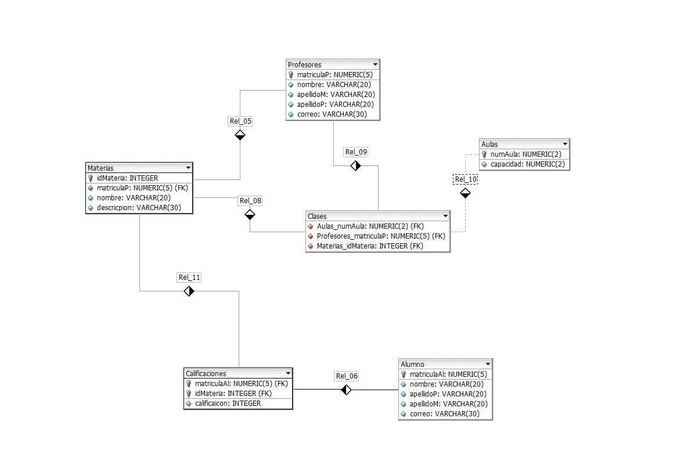

# Escuela
### A partir del siguiente enunciado se desea realizar el modelo entidad-relación para la gestión de una escuela.
 La escuela tiene varios profesores que imparten distintas materias a los alumnos.
 Los profesores tienen un nombre, apellido, correo electrónico y una asignatura que imparten.
 Los alumnos tienen un nombre, apellido, correo electrónico y una lista de asignaturas en las que están matriculados.
 Cada asignatura tiene un nombre, una descripción y calificacion del alumno. Los profesores pueden dar clases a muchos alumnos y los alumnos pueden tener varios profesores.
 Además, cada asignatura es impartida por un solo profesor, pero un profesor puede impartir varias asignaturas.
 Una materia puede contener muchas calificaciones y las calificaciones pueden ser de muchas materias.
 Por último, se desea saber en qué aulas se imparten las clases. Las aulas tienen un nombre y una capacidad máxima de estudiantes.
 
Tambien por otro lado se desea llevar un control sobre los usuarios que pueden acceder al sistema, por lo que se necesitara una base de datos
que maneje a los usuarios, cada usuario tendra que tener un nombre de usuario, contrase;a, fecha de registro, rol y una matricula/numero de registro.
(Cada numero de registro debe de coincidir con la matricula del usuario que se esta registrando/loggeando)
Cada usuario que se cree debe ser verificado si su numero de registro/matricula coincide con una matricula en la base de datos de la escuela, y por ende que esta
no este en uso.

# SCRIPT SQL PARA MANEJAR LA BD DE LA ESCUELA

```sql
CREATE TABLE Profesores (
                            MatriculaP NUMERIC(5) NOT NULL,
                            nombre VARCHAR(20),
                            apellidoM VARCHAR(20),
                            apellidoP VARCHAR(20),
                            correo VARCHAR(30),
                            PRIMARY KEY(MatriculaP)
);

CREATE TABLE Alumnos (
                         MatriculaAl NUMERIC(5) NOT NULL,
                         nombre VARCHAR(20),
                         apellidoP VARCHAR(20),
                         apellidoM VARCHAR(20),
                         correo VARCHAR(30),
                         PRIMARY KEY(MatriculaAl)
);

CREATE TABLE Aulas (
                       numAula NUMERIC(2) NOT NULL,
                       capacidad NUMERIC(2),
                       PRIMARY KEY(numAula)
);

CREATE TABLE Materias (
                          idMateria INTEGER NOT NULL,
                          MatriculaAl NUMERIC(5) NOT NULL,
                          MatriculaP NUMERIC(5) NOT NULL,
                          nombre VARCHAR(20),
                          descripcion VARCHAR(30),
                          numAula NUMERIC(2) NOT NULL,
                          PRIMARY KEY(idMateria, MatriculaAl, MatriculaP),
                          FOREIGN KEY(MatriculaAl) REFERENCES Alumnos(MatriculaAl),
                          FOREIGN KEY(MatriculaP) REFERENCES Profesores(MatriculaP),
                          FOREIGN KEY(numAula) REFERENCES Aulas(numAula)
);

CREATE TABLE Calificaciones (
                                idCalificacion INTEGER NOT NULL,
                                idMateria INTEGER NOT NULL,
                                MatriculaAl NUMERIC(5) NOT NULL,
                                MatriculaP NUMERIC(5) NOT NULL,
                                calificacion INTEGER,
                                PRIMARY KEY(idCalificacion),
                                FOREIGN KEY(idMateria, MatriculaAl, MatriculaP) REFERENCES Materias(idMateria, MatriculaAl, MatriculaP)
);
```



# SCRIPT SQL PARA MANEJAR LOS DATOS DE LOGIN/SIGN UP
### Cabe recalcar que en esta bd se van a hacer querys desde esta bd/usuario hacia la de escuela, habran 3 roles *admin*, *profesor* y *alumno*.
- ### Alumno
  El rol alumno solamente podra hacer login
- ### Maestro
  El rol maestro podra registrar alumnos cuya matricula este dada de alta en el sistema
- ### Admin
  El rol admin podra registrar maestros y profesores, tambien puede dar de alta las matriculas de estos y de otros administradores

```SQL
CREATE TABLE users (
  idusers NUMERIC(5)   NOT NULL ,
  usuario VARCHAR(12)    ,
  clave VARCHAR(20)    ,
  rol VARCHAR(20)      ,
PRIMARY KEY(idusers));
```

### Insercion de un usuario para ser administrador
```SQL
INSERT INTO users VALUES(1,'LeoWan','leomtz1308','Admin');
```
### Permisos para acceder a la tabla Escuela desde users
```SQL
-- Esto se hace desde la tabla escuela
GRANT select ON Profesores TO usuarios;
GRANT select ON alumnos TO usuarios;
/* Estos permisos son para que la tabla usuers sepa que SI existe ese usuario basado en una matricula*/
/*Esto solo aplica en el caso de que el rol sea alumno o maestro*/
-- Cabe mencionar que para que se puedan otorgar se ocupa dar permisos a la tabla escuela
/*Desde el usuario sysdba*/
GRANT ALL PRIVILEGES TO escuela WITH ADMIN OPTION;
```
Es importante tener en cuenta que basicamente <b>NO</b> se manipulala la base de datos desde el programa por lo que no es relevante tener que crear usuarios especiales
en la base de datos, el programa en java se encargara de esto mediante los comandos que se puedne ejecutar, esto me ahorra tiempo y no tengo que crear un esquema tan sotisficado con permisos.

## INSERCION DE DATOS
Estoy haciendo uso de mi programa [Generador de datos](https://github.com/NexWan/Generador-de-datos) para poder hacer insercion de datos para tablas como la de alumnos y profesores.
Algunos datos como los de aula, calificaciones y materia las estoy agregando independientemente.

<b>Como voy a utilizar un metodo para verificar que un usuario ya existe tendre que dar permisos a la tabla de escuela de acceder a los datos de la tabla de usuarios</b>
```SQL
-- Desde el usuario sys o sysdba
GRANT select ON usuarios.users TO escuela;
```

